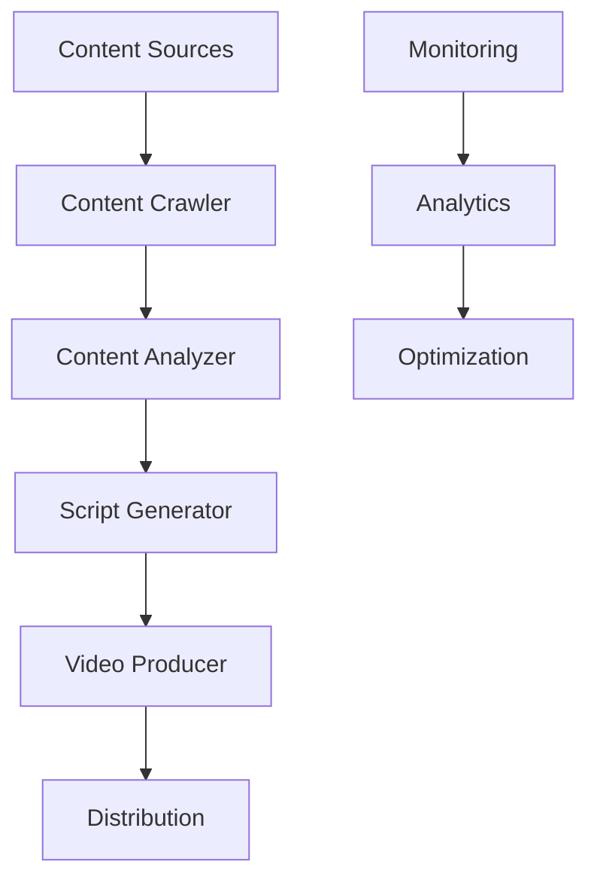

# Solopreneur Startup Coach - Comprehensive Tutorial

## Table of Contents
1. [System Architecture](#system-architecture)
2. [Content Generation](#content-generation)
3. [Video Production](#video-production)
4. [Distribution & Marketing](#distribution-marketing)
5. [Advanced Customization](#advanced-customization)
6. [Performance Optimization](#performance-optimization)
7. [Scaling & Growth](#scaling-growth)

## System Architecture

### Overview
The Solopreneur Startup Coach system is built with a modular architecture:



### Component Interaction
1. Content Flow:
   ```ruby
   class ContentPipeline
     def process_content
       content = ContentCrawler.new.crawl
       analysis = ContentAnalyzer.new.analyze(content)
       script = ScriptGenerator.new.generate(analysis)
       video = VideoProducer.new.create(script)
       Distributor.new.publish(video)
     end
   end
   ```

2. Data Models:
   ```ruby
   # app/models/startup_tip.rb
   class StartupTip < ApplicationRecord
     has_one :video
     validates :title, presence: true
     validates :content, length: { minimum: 100 }
     
     def generate_script
       ScriptGenerator.new(self).generate
     end
   end
   
   # app/models/video.rb
   class Video < ApplicationRecord
     belongs_to :startup_tip
     validates :status, inclusion: { in: %w[pending processing ready failed] }
     
     def produce
       VideoProducer.new(self).produce
     end
   end
   ```

## Content Generation

### Content Crawling
1. Setup NewsAPI Integration:
   ```ruby
   # app/services/startup_crawler.rb
   class StartupCrawler
     def initialize
       @api = News.new(ENV['NEWSAPI_KEY'])
       @sources = ['techcrunch', 'hackernews', 'producthunt']
     end
     
     def crawl
       @sources.flat_map do |source|
         fetch_articles(source)
       end
     end
     
     private
     
     def fetch_articles(source)
       @api.get_everything(
         sources: source,
         language: 'en',
         sort_by: 'relevancy',
         q: 'startup OR entrepreneurship'
       )
     end
   end
   ```

2. Content Filtering:
   ```ruby
   # app/services/content_filter.rb
   class ContentFilter
     def filter(articles)
       articles.select do |article|
         relevant?(article) &&
         not_duplicate?(article) &&
         has_required_length?(article)
       end
     end
     
     private
     
     def relevant?(article)
       keywords = extract_keywords(article)
       calculate_relevance_score(keywords) > 0.7
     end
   end
   ```

### Content Analysis
1. Sentiment Analysis:
   ```python
   # lib/analyzers/sentiment_analyzer.py
   from transformers import pipeline
   
   class SentimentAnalyzer:
       def __init__(self):
           self.analyzer = pipeline('sentiment-analysis')
           
       def analyze(self, text):
           result = self.analyzer(text)
           return {
               'sentiment': result[0]['label'],
               'confidence': result[0]['score']
           }
   ```

2. Topic Extraction:
   ```python
   # lib/analyzers/topic_extractor.py
   from gensim import corpora, models
   
   class TopicExtractor:
       def __init__(self, num_topics=5):
           self.num_topics = num_topics
           self.dictionary = corpora.Dictionary()
           self.lda_model = models.LdaModel()
           
       def extract_topics(self, texts):
           corpus = self.preprocess(texts)
           return self.lda_model.get_document_topics(corpus)
   ```

## Video Production

### Script Generation
1. Template System:
   ```ruby
   # app/services/script_generator.rb
   class ScriptGenerator
     TEMPLATES = {
       intro: [
         "Want to boost your startup's %{metric}? Here's how:",
         "Here's a game-changing tip for %{goal}:",
         "Master %{skill} with this powerful strategy:"
       ],
       body: [
         "First, %{step1}. Then, %{step2}. Finally, %{step3}.",
         "The process is simple:\n1. %{step1}\n2. %{step2}\n3. %{step3}",
         "Here's your action plan:\n• %{step1}\n• %{step2}\n• %{step3}"
       ],
       outro: [
         "Try this today and watch your %{metric} grow!",
         "Implement this strategy to transform your %{aspect}!",
         "Start using this tip and level up your %{skill}!"
       ]
     }
     
     def generate(tip)
       {
         intro: format_section(:intro, tip),
         body: format_section(:body, tip),
         outro: format_section(:outro, tip)
       }
     end
   end
   ```

2. Voice Generation:
   ```python
   # lib/voice/voice_generator.py
   from gtts import gTTS
   import torch
   from transformers import SpeechT5Processor, SpeechT5ForTextToSpeech
   
   class VoiceGenerator:
       def __init__(self):
           self.processor = SpeechT5Processor.from_pretrained("microsoft/speecht5_tts")
           self.model = SpeechT5ForTextToSpeech.from_pretrained("microsoft/speecht5_tts")
           
       def generate(self, text, language='en'):
           inputs = self.processor(text=text, return_tensors="pt")
           speech = self.model.generate_speech(inputs["input_ids"])
           return speech.numpy()
   ```

### Video Creation
1. Visual Elements:
   ```python
   # lib/video/video_composer.py
   from moviepy.editor import *
   
   class VideoComposer:
       def __init__(self, width=1080, height=1920):
           self.size = (width, height)
           self.duration = 45  # seconds
           
       def create_video(self, script, audio):
           clips = []
           
           # Background
           bg = self.create_background()
           clips.append(bg)
           
           # Text overlays
           text_clips = self.create_text_overlays(script)
           clips.extend(text_clips)
           
           # Combine all clips
           final = CompositeVideoClip(clips, size=self.size)
           final = final.set_audio(audio)
           
           return final
           
       def create_background(self):
           # Implementation details...
           pass
           
       def create_text_overlays(self, script):
           # Implementation details...
           pass
   ```

2. Motion Graphics:
   ```python
   # lib/video/motion_graphics.py
   from moviepy.editor import *
   
   class MotionGraphics:
       def __init__(self):
           self.effects = {
               'fade': lambda t: min(1, t/0.5),
               'slide': lambda t: min(1, t/0.3),
               'bounce': lambda t: min(1, abs(math.sin(t*math.pi)))
           }
           
       def apply_effect(self, clip, effect_name):
           if effect_name in self.effects:
               return clip.set_opacity(self.effects[effect_name])
           return clip
   ```

## Distribution & Marketing

### YouTube Integration
1. Upload Configuration:
   ```ruby
   # app/services/youtube_uploader.rb
   class YoutubeUploader
     def initialize
       @service = Google::Apis::YoutubeV3::YouTubeService.new
       @service.authorization = google_auth
     end
     
     def upload(video)
       metadata = build_metadata(video)
       upload_video(video.file_path, metadata)
     end
     
     private
     
     def build_metadata(video)
       {
         snippet: {
           title: video.title,
           description: generate_description(video),
           tags: generate_tags(video),
           category_id: '27'  # Education
         },
         status: {
           privacy_status: 'public',
           self_declared_made_for_kids: false
         }
       }
     end
   end
   ```

2. Analytics Integration:
   ```ruby
   # app/services/youtube_analytics.rb
   class YoutubeAnalytics
     def fetch_metrics(video)
       {
         views: fetch_view_count(video),
         likes: fetch_like_count(video),
         comments: fetch_comment_count(video),
         watch_time: fetch_watch_time(video)
       }
     end
     
     def generate_report(video)
       metrics = fetch_metrics(video)
       create_report(metrics)
     end
   end
   ```

### Social Media Distribution
1. Multi-Platform Publishing:
   ```ruby
   # app/services/social_media_distributor.rb
   class SocialMediaDistributor
     PLATFORMS = [:instagram, :tiktok, :twitter]
     
     def distribute(video)
       PLATFORMS.each do |platform|
         post_to_platform(platform, video)
       rescue StandardError => e
         handle_error(e, platform)
       end
     end
     
     private
     
     def post_to_platform(platform, video)
       adapter = "#{platform}_adapter".classify.constantize.new
       adapter.post(video)
     end
   end
   ```

2. Engagement Tracking:
   ```ruby
   # app/services/engagement_tracker.rb
   class EngagementTracker
     def track(video)
       metrics = {
         youtube: track_youtube(video),
         instagram: track_instagram(video),
         tiktok: track_tiktok(video),
         twitter: track_twitter(video)
       }
       
       store_metrics(video, metrics)
       analyze_performance(metrics)
     end
   end
   ```

## Advanced Customization

### Template Customization
1. Custom Script Templates:
   ```ruby
   # config/initializers/script_templates.rb
   ScriptGenerator.configure do |config|
     config.templates = {
       intro: [
         "Transform your %{business_type} with this %{strategy_type} strategy:",
         "Want to 10x your %{metric}? Here's the secret:",
         "The ultimate %{topic} guide for %{business_type} owners:"
       ],
       # Add more custom templates...
     }
   end
   ```

2. Video Style Configuration:
   ```ruby
   # config/initializers/video_styles.rb
   VideoProducer.configure do |config|
     config.styles = {
       modern: {
         font: 'Roboto',
         colors: ['#2E3440', '#88C0D0'],
         transitions: ['fade', 'slide']
       },
       minimal: {
         font: 'Helvetica',
         colors: ['#000000', '#FFFFFF'],
         transitions: ['fade']
       }
     }
   end
   ```

### AI Integration
1. Custom Language Models:
   ```python
   # lib/ai/custom_llm.py
   from transformers import AutoModelForCausalLM, AutoTokenizer
   
   class CustomLLM:
       def __init__(self, model_name):
           self.tokenizer = AutoTokenizer.from_pretrained(model_name)
           self.model = AutoModelForCausalLM.from_pretrained(model_name)
           
       def generate(self, prompt, max_length=100):
           inputs = self.tokenizer(prompt, return_tensors="pt")
           outputs = self.model.generate(**inputs, max_length=max_length)
           return self.tokenizer.decode(outputs[0])
   ```

2. Content Enhancement:
   ```ruby
   # app/services/content_enhancer.rb
   class ContentEnhancer
     def enhance(content)
       enhanced = {
         title: optimize_title(content.title),
         description: expand_description(content.description),
         keywords: extract_keywords(content)
       }
       
       apply_enhancements(content, enhanced)
     end
   end
   ```

## Performance Optimization

### Caching Strategy
1. Content Cache:
   ```ruby
   # config/initializers/cache_store.rb
   Rails.application.configure do
     config.cache_store = :redis_cache_store, {
       url: ENV['REDIS_URL'],
       expires_in: 1.day
     }
   end
   ```

2. API Response Caching:
   ```ruby
   # app/services/cached_api_client.rb
   class CachedApiClient
     def fetch_data(endpoint, params)
       cache_key = generate_cache_key(endpoint, params)
       
       Rails.cache.fetch(cache_key, expires_in: 1.hour) do
         api_client.get(endpoint, params)
       end
     end
   end
   ```

### Background Processing
1. Job Configuration:
   ```ruby
   # config/initializers/sidekiq.rb
   Sidekiq.configure_server do |config|
     config.redis = { url: ENV['REDIS_URL'] }
     
     config.on(:startup) do
       schedule_file = "config/schedule.yml"
       Sidekiq::Cron::Job.load_from_hash YAML.load_file(schedule_file)
     end
   end
   ```

2. Job Monitoring:
   ```ruby
   # app/services/job_monitor.rb
   class JobMonitor
     def monitor_jobs
       {
         queued: Sidekiq::Queue.new.size,
         processing: Sidekiq::Workers.new.size,
         failed: Sidekiq::RetrySet.new.size,
         scheduled: Sidekiq::ScheduledSet.new.size
       }
     end
   end
   ```

## Scaling & Growth

### System Scaling
1. Database Optimization:
   ```ruby
   # config/initializers/database_optimization.rb
   ActiveRecord::Base.connection.execute(<<-SQL)
     PRAGMA journal_mode = WAL;
     PRAGMA synchronous = NORMAL;
     PRAGMA temp_store = MEMORY;
     PRAGMA mmap_size = 30000000000;
   SQL
   ```

2. Content Distribution:
   ```ruby
   # app/services/content_distributor.rb
   class ContentDistributor
     def distribute(content)
       Parallel.map(platforms, in_threads: 4) do |platform|
         distribute_to_platform(platform, content)
       end
     end
   end
   ```

### Analytics & Growth
1. Performance Tracking:
   ```ruby
   # app/services/analytics_tracker.rb
   class AnalyticsTracker
     def track_metrics
       {
         content: track_content_metrics,
         engagement: track_engagement_metrics,
         distribution: track_distribution_metrics,
         growth: track_growth_metrics
       }
     end
   end
   ```

2. Growth Optimization:
   ```ruby
   # app/services/growth_optimizer.rb
   class GrowthOptimizer
     def optimize
       analyze_performance
       identify_opportunities
       generate_recommendations
       implement_improvements
     end
   end
   ```

Remember to check the [API Documentation](docs/api/API.md) for detailed API references and the [Templates Guide](docs/templates/TEMPLATES.md) for more customization options. 